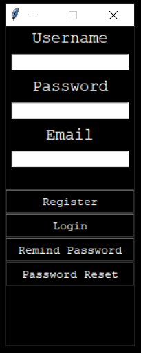
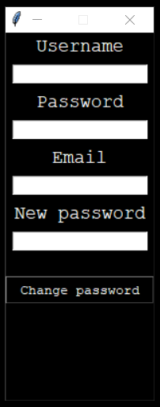
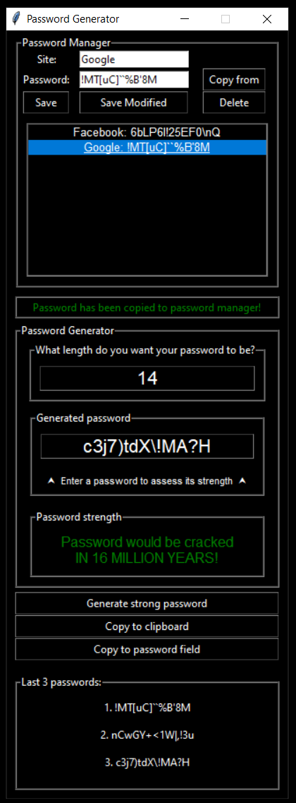

# Secure Password Manager/Generator

A secure password manager that includes password generation, strength checking and login functionality all in one platform.

# Installation

This program can be used as is by simply running the Python script. However, creating an .exe file makes the program more user-friendly.

Steps for making a launchable .exe file:

1.Most modules used in this project are pre-installed with Python. The only modules you need to install are cryptography, pywin32, and pyinstaller. To install these modules, run these commands in CMD:

`pip install cryptography`
`pip install pywin32`
`pip install pyinstaller`

2.From the directory where project files are located (don't forget the locked.ico file), launch this command in CMD:

`pyinstaller --name=PasswordManager --noconsole --onefile --icon=locked.ico Login.py`

3.After the file conversion is done you will be able to find the PasswordManager.exe file in the /dist folder.

4.For "Password reset" functionality to work as intended you should write in code 594 and 595 your email and third-party access code respectively.

`sender_email = ""`

`sender_password = ""`

# Usage

Register: All fields are required to be filled.

Login: Only the password and username fields are required to log in.

Remind Password: Only the email is required for this action.

Password Reset: This action opens a new Tkinter window where the password reset process is initiated.

Appropriate error/success messages are shown if incorrect/correct fields are filled.

Change password: To change the password, all fields must be filled correctly.

Appropriate error/success messages are shown if incorrect/correct information is entered.

#### Password Manager:

Site: Enterable field for site/Shows site information of a selected entry from the listbox below.

Password: Enterable field for password/Shows password information of a selected entry from the listbox below.

Listbox: Shows all saved site/password entries. Double-clicking an entry selects it.

Save: Saves the site and password that are entered in the appropriate fields.

Save Modified: (with selected password from the listbox below) Edits site and password entries, overwriting the selected entry from the listbox.

Delete: (with selected password from the listbox below) Deletes the selected entry.

Copy from: Copies the password of a selected entry from the listbox.

#### Password Generator:

What length do you want your password: Enterable field that takes a number from 4 to 18, which is later used for password generation.

Generated password: Shows the generated password/You can enter your own password to check its strength.

Password strength: Shows the strength of the password entered in the "Generated password" field.

Generate strong password: Takes the number from the "What length do you want your password" field and generates an appropriate length password.

Copy to clipboard: Copies the generated password to the clipboard.

Copy to password field: Copies the generated password to the password field in the Password Manager.

Last 3 passwords: Stores the last 3 generated passwords. Double-clicking on a password copies it to the "Generated password" field.

Appropriate error/success messages are shown in box between Password manager and Password generator.

# Features

#### Login features:

Password is hashed using SHA-256 (password+username is used for hash)

Password reset function sends email to registered user's email (for this function you need to provide email and access code for third-party usage. Lines 594 and 595)

Other functionality is standard: Register, Login, Password Change.

#### Password manager features:

Password inside password manager is encrypted using fernet key assigned to each user. So passwords are visible to loged in user, but are scrambled inside database.

All standard CRUD functionality is present.

#### Password generator features:

Secure password of selected lenght (4-18) is generated.

Strength is checked for each password generated or entered (Strength is checked with every change to "Generated password" field).

Last 3 generated passwords are stored.

Generated password can be copied to clipboard or Password manager's password field.

# Contributing

If you'd like to contribute to the Password manager, please fork the repository and make your changes in a new branch. When you're ready, submit a pull request explaining your changes and why they should be merged.

# Credits

The password generator was created by Me/Marijus and is based on code from the Python Standard Library.

# License

This project is licensed under the MIT License.

# Contact

If you have any questions or feedback about the password generator, please feel free to contact Me/Marijus at marijusknabikas@gmail.com.

